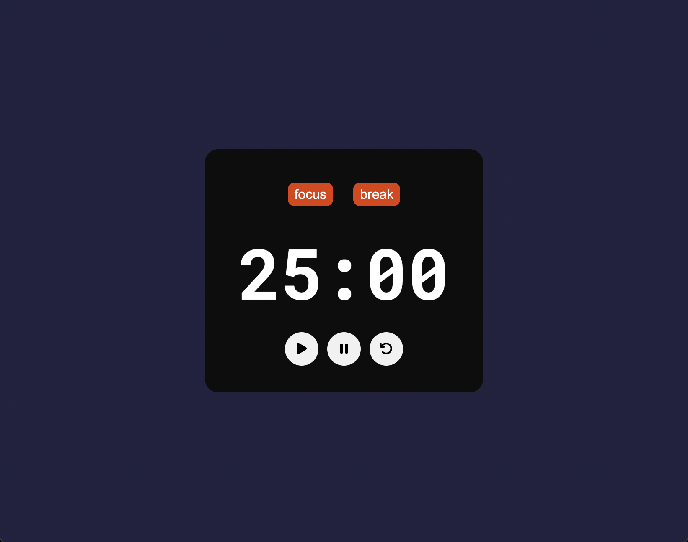

### Esercizio
Creare un pomodoro timer: che premendo un bottone avvi un timer di 25 minuti;
- premendo un bottone partirà il timer di 25 minuti,
- allo scadere del timer partirà un altro timer di 5 minuti,
- tramite un bottone resettare il timer e usarlo di nuovo.

### Svolgimento
- [X] creare in html lo scheletro del timer con i bottoni annessi
- [X] sistemarlo con css;

- [X] determiniamo le costanti e le variabili per:
- bottone di work;
- bottone di break;
- bottone di play;
- bottone di pause;
- bottone di restart.
- [X] al premere del pulsante start si avviera un timer di 25 minuti, al termine del quale suonerà una sveglia.
- [X] al premere del pulsante pausa: si fermerà il timer e per farlo ripartire bisogna premere sul pulsante play,
- [X] al premere del pulsante reset, si azzerà il timer e rinizierà da 25 minuti.

- [X] tramite una funzione determiniamo che allo start inizierà una funzione:
  - decremente il timer di 1 ogni secondo fino ad arrivare a 00:00;
  - una volta arrivato a 00:00 partirà il timer del break;
- [X] treamite una funzione: creiamo una funzione che aumenti il timer e lo aggiorni all'interno del DOM ogni secondo.

- quando il timer è sulla sezione focus, l'altra sezione sarà oscurata e viceversa.

### Come funziona:
- premere il pulsante play ed avvierà un timer di 25 minuti;
- premere il pulsante di pausa: fermerà il timer e ripremendo play partirà da dovi ti sei fermato;
- allo scadere del timere si attiverà un audio per fa capire che il timer è finito;
- premere il pulsante play nuovamente, e partirà un timer di 5 minuti per il break;
- premere restart per riutilizzare il timer quante olte si vuole;